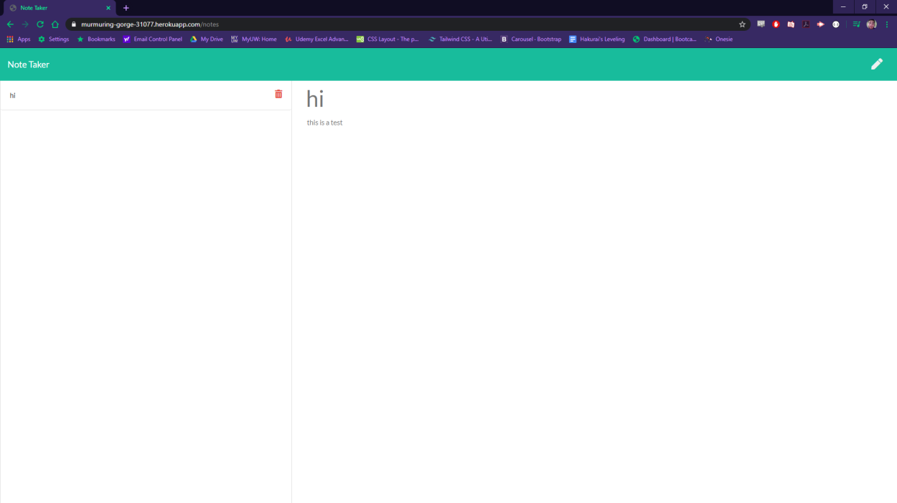

# Notes

## Description
This project is to make a note generator to store ones notes

---

## Table of Contents
*[Description](#description)

*[Installation](#installation)

*[GitHub](#github)

---

## Installation
The user will need to init and install inquirer to use this generator.

you can also view this note generator at https://murmuring-gorge-31077.herokuapp.com/

---

## Usage for My Project
The use of this project is to make it fast and easy for users to store and delete notes.

---

## Contributors and Help
Louis Coleman

---

## Tests
there are no tests for this project.

---

## GitHub

https://github.com/coleloui

No user email

---
                    
                    